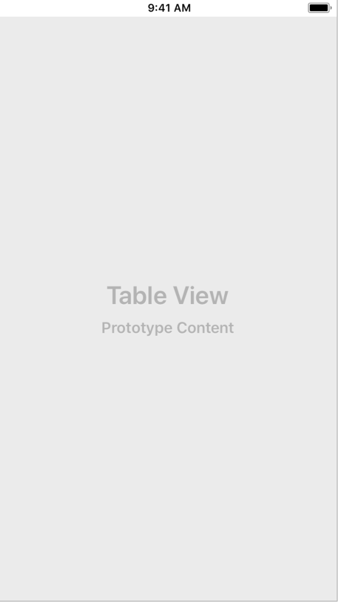

## IOS-UITableView基本使用

通过`storyboard`设置UItableView后，通过约束将UItableView长宽设置为全屏。



`UIViewController代码`

```objc
@interface ViewController () <UITableViewDataSource>
@property (weak, nonatomic) IBOutlet UITableView *tableView;
@end

@implementation ViewController
- (void)viewDidLoad {
    [super viewDidLoad];
    self.tableView.dataSource = self;
}

//tableView中将会有几个截面[组]
- (NSInteger)numberOfSectionsInTableView:(UITableView *)tableView{
    //这里示例给tableView分了4个组
    return 4;
}

//每组会有几行
-(NSInteger)tableView:(UITableView *)tableView numberOfRowsInSection:(NSInteger)section{
    //组从0算起[section:截面、截断的意思，因为这里和组意思相近，就暂定意为组]
    if(section == 0){
        return 3;
    }else if(section == 1){
        return 1;
    }else if(section == 2){
        return 4;
    }else{
        return 2;
    }
}

//每行中的内容
-(UITableViewCell *)tableView:(UITableView *)tableView cellForRowAtIndexPath:(NSIndexPath *)indexPath{
    UITableViewCell *cell = [[UITableViewCell alloc] init];
    //此时只设置第0组
    if(indexPath.section == 0){
        if(indexPath.row == 0){
            cell.textLabel.text = @"通用";
        }else if(indexPath.row == 1){
            cell.textLabel.text = @"隐私";
        }else{
           cell.textLabel.text = @"地图";
        }
    }
    //将创建的UITableViewCell返回
    return cell;
}
@end
```

给UItableView设置数据需要遵守`UITableViewDataSource`协议，一般为当前UIViewController。

内部`UItableView`调用方法的顺序是: 

```objc
numberOfSectionsInTableView -> 创建组
(NSInteger)tableView:(UITableView *)tableView numberOfRowsInSection: -> 定义每个组有多少行
(UITableViewCell *)tableView:(UITableView *)tableView cellForRowAtIndexPath:(NSIndexPath *)indexPath -> 定义每行中的内容
```
