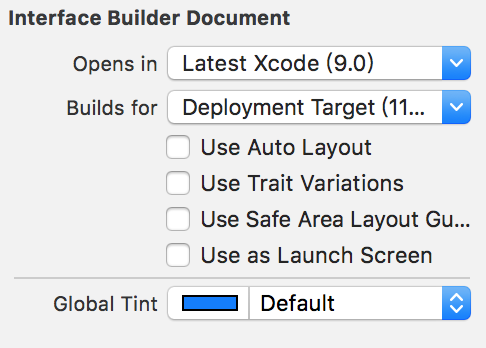

## IOS之AutoresizingMask[代码和storyboard中使用]

```objc
#import "ViewController.h"
@interface ViewController ()
@end
@implementation ViewController
- (void)viewDidLoad {
    [super viewDidLoad];
    UIView *view = [[UIView alloc] init];
    view.frame = CGRectMake(self.view.frame.size.width - 100, self.view.frame.size.height - 100, 100, 100);
    view.backgroundColor = [UIColor redColor];
    //修改UIView的布局为相对父控件的位置和大小
    /*
     UIViewAutoresizingNone   ---> 默认autoResizing布局
     UIViewAutoresizingFlexibleLeftMargin  ---> 左侧边距相对父控件左侧边框距离自动伸缩
     UIViewAutoresizingFlexibleBottomMargin  ---> 底部边距相对父控件底部边框距离自动伸缩
     UIViewAutoresizingFlexibleRightMargin  ---> 右侧边距相对父控件右侧边框距离自动伸缩
     UIViewAutoresizingFlexibleTopMargin  ---> 顶部边距相对父控件顶部边框距离自动伸缩
     
     UIViewAutoresizingFlexibleWidth  ---> 容器宽度相对父容器的宽度比例自动设置
     UIViewAutoresizingFlexibleHeight  ---> 容器高度相对父容器的高度比例自动设置
     */
    view.autoresizingMask = UIViewAutoresizingFlexibleLeftMargin | UIViewAutoresizingFlexibleTopMargin | UIViewAutoresizingFlexibleWidth | UIViewAutoresizingFlexibleHeight;
    [self.view addSubview:view];
}
@end
```

**`AutoresizingMask 与 AutoLayout俩者有冲突，所以用了AutoresizingMask 之后就能采用AutoLayout 了。`**

